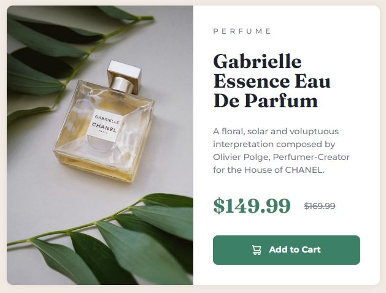

# Frontend Mentor - Product preview card component solution

This is a solution to the [Product preview card component challenge on Frontend Mentor](https://www.frontendmentor.io/challenges/product-preview-card-component-GO7UmttRfa).

The card features a **responsive layout** and was created in a **mobile-first workflow** with **accessibility** in mind. Its button has **hover, focus and active states** to provide feedback to the user and ensure great **tab navigation**.

## Links

- [Solution on Frontend Mentor]()
- [Live Site on GitHub Pages]()

## Screenshots

|                                      Mobile                                      |     |                                       Desktop                                        |
| :------------------------------------------------------------------------------: | :-: | :----------------------------------------------------------------------------------: |
|  |     |  |

## My process

### What I learned

#### Accessibility

The design presented an interesting **accessibility-related challenge**: the card contains the current (discounted) price and the crossed-out original price, but most screen readers do not describe the latter as crossed-out text when reading it out. To ensure a great experience for all users, a **visually-hidden sentence** describing the prices is included, while the displayed prices are hidden from screen readers with `aria-hidden="true"`:

```html
<!-- Hidden from screen readers -->
<div class="product-card__prices" aria-hidden="true">
  <p class="product-card__price">$149.99</p>
  <s class="product-card__price-old">$169.99</s>
</div>

<!-- Visually-hidden text -->
<p class="visually-hidden">For $149.99 instead of $169.99</p>
```

```css
.visually-hidden {
  clip: rect(0 0 0 0);
  clip-path: inset(50%);
  height: 1px;
  overflow: hidden;
  position: absolute;
  white-space: nowrap;
  width: 1px;

  /* Source: https://www.a11yproject.com/posts/how-to-hide-content/ */
}
```

#### Responsive design

The card must adapt its layout and display a different (bigger or smaller) image depending on the device's screen width. To achieve that, **Flexbox** and **media queries** were used in a **mobile-first workflow**. The card is coded primarily for mobile devices, with its elements stacked vertically.

In devices with a viewport width larger than 48 rems (768 px in the default 16 px font size), the card's layout becomes horizontal and a bigger product image is displayed. Moreover, the `flex-basis` property is used to divide the card equally in half:

```css
@media screen and (min-width: 48rem) {
  .product-card {
    flex-direction: row;
    max-width: min(90%, 38rem);
  }

  /* (...) */

  .product-card__mobile-img {
    display: none;
  }

  .product-card__desktop-img {
    display: block;
  }

  .product-card__img,
  .product-card__body {
    flex-basis: 50%;
  }

  /* (...) */
}
```

#### Button with different states

Every browser has different default styles for the `<button>` element. To ensure the same design is seen across browsers, `all: unset` is used to create a clean slate on which the button can be styled.

When hovered or focused, the button's `background-color` becomes darker. To create a great **tab navigation** experience, it also receives an outline in its `focus-visible` state — with proper contrast with the background and an offset to ensure it stands out. Finally, to give the user feedback indicating that the button has been clicked, it is slightly shrunk in its `active` state.

The look of the button transitions nicely in a few milliseconds when changing states, but the user preferences are respected: a media query disables all animations, transitions and smooth scrolling if the user **prefers reduced motion**.

<table align="center">
  <tr>
    <td align="center"></td>
  </tr>
  <tr>
    <td align="center">The different states of the button.</td>
  </tr>
</table>

#### Other skills

In this project, I also practiced the use of **Git** — including branching, merging, and the `git stash` command —, **semantic HTML markup**, **CSS custom properties** and the **BEM naming convention**.

### Continued development

In future projects, I want to give the user more feedback when interacting with buttons. This could be achieved by changing the "Add to cart" button text to "Item added to cart ✅" via a CSS animation or by displaying a toast message, for example.

I also want to keep learning about the best practices when it comes to creating great experiences for users who rely on assistive technologies to navigate the web.

### Useful resources

- [_A Complete Guide to Links and Buttons_ — Chris Coyier (CSS-Tricks)](https://css-tricks.com/a-complete-guide-to-links-and-buttons/) - This guide covers many of the aspects that should be considered when working with links, buttons and button-like inputs.
- [_How-to: Hide content_ — Dave Rupert (The A11Y Project)](https://www.a11yproject.com/posts/how-to-hide-content/) - This short how-to covers the best practices for visually hiding content while still making it available to assistive technologies. It is the source of the `visually-hidden` CSS class used in this project.
- [_Price vocalization_ — Orange digital accessibility guidelines](https://a11y-guidelines.orange.com/en/web/components-examples/price-vocalization/) - Orange's guidelines for price vocalization contain examples on how to code prices in a screen reader-friendly way.
- [_A Modern CSS Reset_ — Andy Bell](https://piccalil.li/blog/a-modern-css-reset/) - The media query for reduced motion is part of Andy Bell's Modern CSS Reset.

## Author

- Frontend Mentor - [@JulioCinquina](https://www.frontendmentor.io/profile/JulioCinquina)
